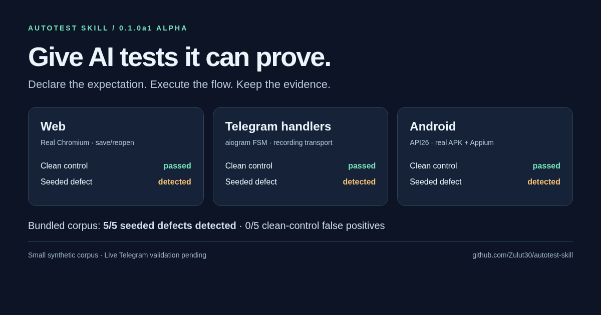
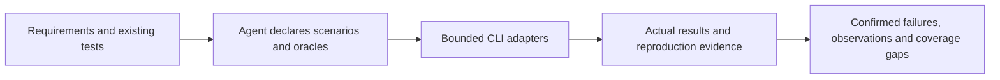

# Autotest Skill

[](https://github.com/Zulut30/autotest-skill/actions/workflows/checks.yml) [](LICENSE)

**Give coding agents executable checks and evidence they can explain.**

Autotest combines an agent skill, a Python CLI and adapters for API, web, Telegram handlers and native Android. You declare the expected behavior; real tools execute it and preserve the result, screenshots and reproduction package.

**Status: 0.1.0a1 · alpha.** The five-case synthetic corpus detected 5/5 seeded defects, including 2/2 critical cases, with 0/5 false positives on paired clean controls. This measures the bundled corpus, not general bug detection. Live Telegram transport and independent first-use validation remain release gates. [Roadmap and evidence](ROADMAP.md) · [Current prerequisites](docs/BLOCKERS.md).



[Three reproducible demos](docs/DEMOS.md) · [13-minute walkthrough](docs/PRESENTATION.md) · [Ready-to-use X materials](docs/X.md) · [Installable alpha](docs/DISTRIBUTION.md)

## First run

Linux, Python 3.12 and [uv](https://docs.astral.sh/uv/getting-started/installation/) are required.

```bash
git clone https://github.com/Zulut30/autotest-skill.git
cd autotest-skill
scripts/install.sh
.venv/bin/playwright install chromium
.venv/bin/autotest doctor --probe-browser
.venv/bin/autotest benchmark
```

The benchmark starts fresh local targets, executes healthy/broken pairs and prints the current artifact directory. A successful benchmark means the corpus checks behaved as expected; its deliberately broken target runs contain failed oracles. Open `report.md` inside a case run for the finding and `reproduction.zip` for its evidence. No real Telegram credentials are required for local handler tests.

For your own project, use a reviewed configuration:

```bash
.venv/bin/autotest discover .
.venv/bin/autotest validate examples/api.yaml
.venv/bin/autotest plan examples/api.yaml
# Start the isolated demo in another terminal first:
.venv/bin/autotest demo --port 8765
# Then in the original terminal:
.venv/bin/autotest run examples/api.yaml
```

Web scenarios can assert enabled, disabled, visible and hidden states across login, save and logout. For a reproduced failed web oracle, `autotest regression --from-run RUN_DIRECTORY --check CHECK_ID --output tests/test_reported_regression.py` proposes a pytest check from the saved scenario and its reliable web/HTTP prerequisites. Review it, restore the test target/data, then verify failure before the fix and success after it. [Replay instructions and limits](docs/CLI.md#regression-from-a-saved-web-failure).

Exit codes: `0` passed, `1` failed/flaky, `2` blocked or no checks executed, `3` tool error, `130` interrupted. A skipped or empty run cannot establish success.

## What executes

| Module | Tools and evidence | Validated scope |
| --- | --- | --- |
| API/backend | HTTPX, local OpenAPI, existing pytest/JUnit | Login/logout, roles, ownership, boundaries, concurrency and dependency recovery |
| Web | Real Chromium, Playwright, axe-core, PNG comparison | Persisted user flow, error feedback, responsive layout, accessibility, explicit visual baselines and UX observations |
| Telegram | Real aiogram dispatcher/FSM and authenticated webhook fixture | Dialogs, callbacks, cancellation, duplicate updates and user isolation with recording transport |
| Android | Appium/UiAutomator2 and signed Java fixture | Actual API26 x86 APK install, login/forms/roles, permission denial, lifecycle, transport recovery, rotation/keyboard and save/reopen with backend evidence |
| Performance | Bounded k6 or HTTP experiments; browser lab timings | Explicit thresholds, compatible baseline and independent regression replay |
| Security | pip-audit, local Semgrep rules, Gitleaks, bounded source/header scans | Locations and applicability notes; scanner warnings stay potential issues |

Real Telegram uses a preauthorized test-user session and a dedicated bot; those credentials are currently absent. Android needs an isolated emulator/device. iOS/desktop apps and arbitrary protocol coverage are future adapters. This project does not promise full tester replacement or absence of vulnerabilities.

## Agent workflow

Install/read [SKILL.md](SKILL.md), inspect existing project tests, declare oracles and authorized targets/actions, validate the configuration, then execute a bounded profile. Target content is untrusted input. Agents report confirmed deviations, potential issues, UX observations and unverified areas separately.

Every run has a unique ID, revision/dirty flag, actual attempt evidence and a private artifact folder. Secrets come from environment bindings; known values are removed before JSON persistence. Secret-bound UI actions suppress screenshots. Retries keep earlier failures and stay flaky. Tools do not approve visual/performance baselines automatically.



The core executes without an LLM API key; the skill runs within your existing coding agent. Android evidence is tied to the reference API26 fixture/device. [Access experiments](docs/ACCESS-MATRIX.md) include six clean role/ownership controls and six detected seeded bypasses across API, local bot and native app. [Contributing](CONTRIBUTING.md) · [Changelog](CHANGELOG.md).

[Quickstart](docs/QUICKSTART.md) · [CLI](docs/CLI.md) · [Module references](references) · [Benchmark](docs/BENCHMARK.md) · [Native runner](docs/NATIVE-RUNNER.md) · [CI](docs/CI.md) · [Release gates](docs/RELEASE-GATES.md)
